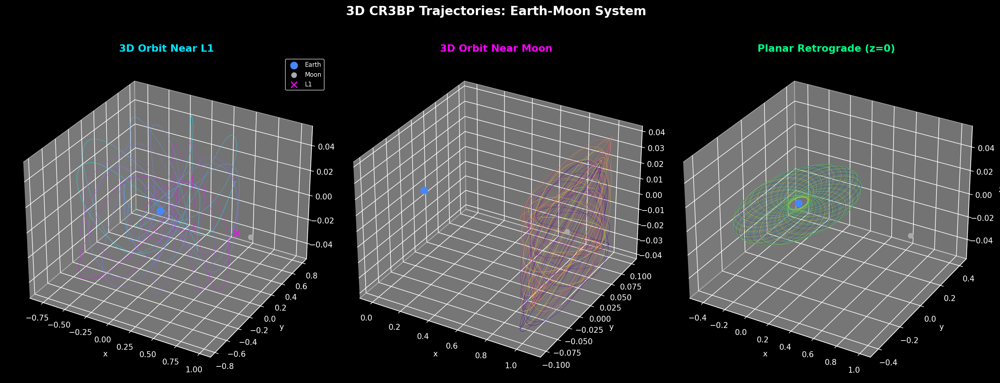
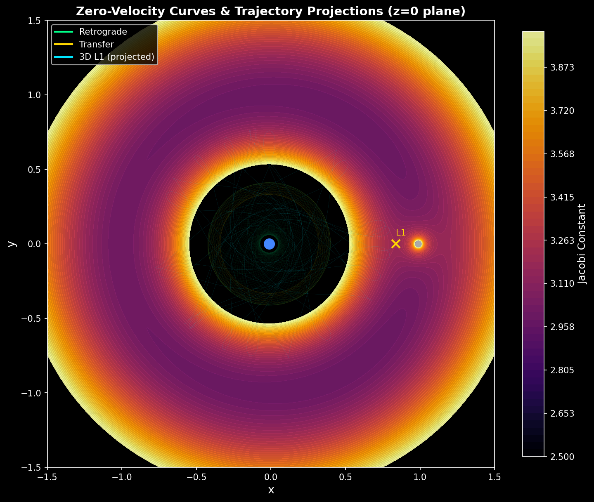
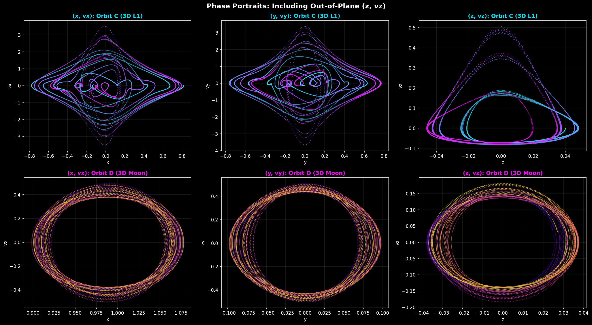
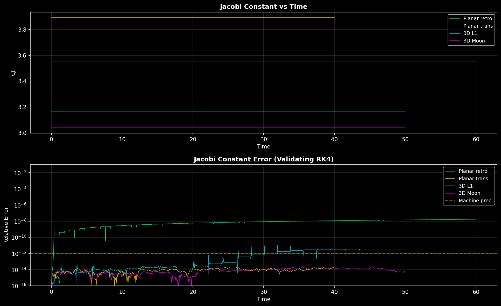
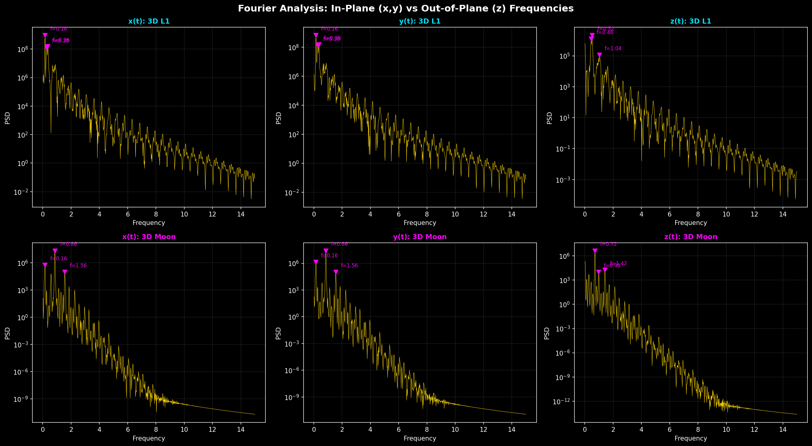

# CR3BP: Earth-Moon System

A numerical toolkit for the 3D Circular Restricted Three-Body Problem (CR3BP), applied to the Earth-Moon system.

Originally developed for ME2 Maths & Computing coursework at Imperial College London (2025-2026), refactored here into a tested, reusable Python package.



## What physics this models

The problem being solved is called the 3D Circular Restricted Three-Body Problem (CR3BP) for the Earth-Moon system. This model involves a spacecraft of negligible mass moving under the combined gravitational attraction of the Earth and the Moon, which orbit their common centre of mass in circular orbits. The system is set in a rotating frame of reference where both bodies (referred to as primaries) are assumed as stationary, introducing Coriolis and centrifugal force terms. The problem is non-dimensionalised using the distance, total mass, and orbital period of the Earth-Moon system. The aim is to compare planar and spatial trajectories for different initial conditions, and to examine how the orbit shape, energetically allowed regions, and numerical conservation properties change.

## Differential equations

```
x'' - 2y' = ∂Ω/∂x
y'' + 2x' = ∂Ω/∂y
z''       = ∂Ω/∂z
```

Where Ω is the effective potential, combining gravitational attraction from both primaries with the centrifugal effect of the rotating frame.

```
Ω(x, y, z) = 0.5*(x² + y²) + (1-μ)/r1 + μ/r2

r1 = sqrt((x+μ)² + y² + z²)   r2 = sqrt((x-1+μ)² + y² + z²)
```

By substituting Ω(x, y, z), the 3D CR3BP becomes:

```
x'' - 2y' = x - (1-μ)(x+μ)/r1³ - μ(x-1+μ)/r2³
y'' + 2x' = y - (1-μ)y/r1³ - μy/r2³
z''       = -(1-μ)z/r1³ - μz/r2³
```

```
μ = M_Moon / (M_Earth + M_Moon) = 7.342×10^22 / (5.972×10^24 + 7.342×10^22) ≈ 0.01215058
```

Define the state vector `u = [x, y, z, vx, vy, vz]^T`.

Reference (where I learned about this problem): Szebehely, V. (1967) Theory of Orbits: The Restricted Problem of Three Bodies. Academic Press.

## Initial values imposed

`u(0) = [x0, y0, z0, vx0, vy0, vz0]^T`

A total of four sets of orbits were tested:

- Orbit A: Planar retrograde = `[0.4, 0, 0, 0, -1.2, 0]`
- Orbit B: Planar transfer = `[0.4, 0, 0, 0, 1.05, 0]`
- Orbit C: 3D Orbit near L1 Lagrange point = `[0.817, 0, 0.04, 0, -0.15, 0]`
- Orbit D: 3D Orbit near Moon = `[0.92, 0, 0.03, 0, 0.5, 0.05]`

## Numerical method and why

The numerical method used is the classical fourth-order Runge-Kutta method (RK4). This problem is an initial value problem that must be advanced over many time steps, so accumulated numerical error matters. RK4 was chosen because it gave accurate trajectories with acceptable computational cost for this project. The second-order equations were first rewritten as a first-order system in the variables (x, y, z, vx, vy, vz), which allows RK4 to be applied directly. For the chosen step size Δt = 0.0002, the Jacobi constant remained nearly constant for all four tested trajectories, so RK4 was sufficiently stable and accurate for the present analysis.

State expressions for boundary conditions: Initial value problem (IVP). No spatial boundary conditions are imposed because the motion is solved in an open domain. The chosen initial conditions give two planar trajectories and two spatial trajectories, allowing direct comparison between in-plane and out-of-plane motion.

The Jacobi constant is defined as:

```
CJ = 2Ω - v²
```

This constant describes the total mechanical energy of the spacecraft in the rotating frame, which is conserved for this system. It relates the velocity of the spacecraft to its position in space, and hence can be used to find regions where the spacecraft will not be able to travel, since the velocity would need to be imaginary (v² < 0) in those forbidden zones.

## Discretisation (RK4 stages)

```
t_n = t0 + n*h
u_n ≈ u(t_n)
du/dt = f(t, u)

k1 = h * f(t_n, u_n)
k2 = h * f(t_n + h/2, u_n + k1/2)
k3 = h * f(t_n + h/2, u_n + k2/2)
k4 = h * f(t_n + h, u_n + k3)
u_(n+1) = u_n + (1/6)(k1 + 2k2 + 2k3 + k4)
```

## Variable types used in Python

At each time step, the solution is stored as a one-dimensional NumPy array containing the six state variables [x, y, z, vx, vy, vz]. The full trajectory is stored as a two-dimensional NumPy array with one row per time step and six columns. The time values are stored in a one-dimensional array. The RK4 increments k1 to k4 are also one-dimensional arrays of length six. The parameters mu and dt are scalar floating-point variables.

## Stability

The CR3BP is known to be numerically challenging due to steep gravitational gradients near the primaries. Stability and accuracy were assessed by monitoring the Jacobi constant CJ, which is analytically conserved in the CR3BP. For the chosen step size Delta t = 0.0002, the relative drift remained small for all four trajectories: about 1.71 x 10^-8 for orbit A, 2.21 x 10^-14 for orbit B, 1.15 x 10^-11 for orbit C, and 1.90 x 10^-14 for orbit D. The largest error occurred for orbit A, which passes closer to the Earth and therefore experiences more rapidly varying acceleration. This suggests that the dominant source of error is time discretisation rather than numerical instability of RK4 itself.







## Results discussion

The 3D plots show that orbits C and D have clear bounded out-of-plane motion, while orbit A remains exactly at z=0, confirming the 3D code correctly reduces to the planar case.

The in-plane panels (x, vx) and (y, vy) show coupled orbital dynamics, while the (z, vz) panel confirms out-of-plane motion is bounded and oscillatory. Orbit C (L1, top row) shows complex diamond-shaped structures which reflect its higher energy, while Orbit D (Moon, bottom row) shows tighter circular loops indicating more regular, confined motion.

The zero-velocity contours help interpret the motion by showing the energetically allowed regions associated with the Jacobi constant. These contours show the Jacobi constant across the z=0 plane, revealing forbidden regions (coloured bands) where the spacecraft cannot travel. All three overlaid trajectories remain confined within their allowed zones, with L1 marked between Earth and Moon, obeying energy conservation.

## Link to another topic in ME2 Computing

As a post-processing step, the discrete Fourier transform was applied to the sampled signals x(t), y(t), and z(t). This links the orbit simulation to the Fourier-analysis topic in ME2 Computing. A Hanning window was applied before the FFT to reduce spectral leakage. The spectra were used to compare the dominant frequencies of the spatial trajectories. For example, orbit C showed dominant z frequencies near 0.520, 0.460, and 1.040, indicating structured but multi-frequency vertical motion. Since the FFT is applied to a finite sampled signal, the spectra are approximate and depend on both the sampling interval and the total signal length.



## Other remarks

This is the restricted, not the general, three-body problem, because the spacecraft does not influence the Earth or Moon. The z equation contains only gravitational terms, since Coriolis and centrifugal effects act in the rotating x-y plane. This allows bounded out-of-plane oscillation in the spatial cases. The equations are non-dimensional, so the numerical results can be rescaled afterwards to physical Earth-Moon units if needed.

## Repo structure

```
src/cr3bp/
  dynamics.py             effective potential, equations of motion, Jacobi constant, Lagrange points
  integrator.py           RK4 step + full trajectory integration
  initial_conditions.py   the four orbit definitions (A-D)
  postprocessing.py       Poincare sections, zero-velocity field, FFT analysis
scripts/
  run_analysis.py         end-to-end script: integrates all orbits, validates, saves all figures
notebooks/
  CR3BP_earth_moon_analysis.ipynb   original exploratory notebook, preserved for reference -- see src/cr3bp/ for the tested, production version
tests/
  test_dynamics.py        sanity tests: Jacobi conservation, planar reduction, Lagrange point
figures/                  generated output figures
```

## Usage

```bash
git clone <this-repo>
cd cr3bp-earth-moon
pip install -r requirements.txt

# Run the full analysis (integrates all 4 orbits, saves figures to ./figures/)
python scripts/run_analysis.py

# Run the test suite
pytest tests/ -v
```

Or use the package directly:

```python
from cr3bp import integrate, jacobi
from cr3bp.initial_conditions import STATE_C, N_STEPS_C

traj, time = integrate(STATE_C, dt=0.0002, n_steps=N_STEPS_C)
print(jacobi(traj[0]))  # Jacobi constant at t=0
```

## References

Szebehely, V. (1967) Theory of Orbits: The Restricted Problem of Three Bodies. Academic Press.

ME2 Computing lecture slides, Imperial College London, 2025-2026.

## License

MIT, see [LICENSE](LICENSE).
